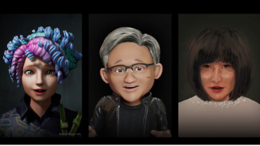

# AI Hack Track

#### Introduction

As the Metaverse rapidly emerges as a playground for innovation and creative expression, the integration of artificial intelligence (AI) assumes a pivotal role in shaping the digital experiences.

#### Motivation

The Metaverse, characterized by its immersive fusion of virtual and augmented realities, offers an expansive canvas for developers to realize their boldest ideas. 
The integration of AI augments this canvas with powerful tools to transcend traditional boundaries, enabling the creation of intricate, adaptive, and context-aware applications that seamlessly interact with users. 
With AI-powered algorithms at their disposal, developers can harness the potential to craft virtual worlds that respond intelligently to user actions, adapt in real time to changing environments, and create personalized experiences that resonate with individuals on a deeper level. These capabilities empower to build immersive simulations, gamified experiences, and collaborative platforms that redefine engagement in the digital age. The accessibility of AI-driven tools and frameworks expedites the creation of prototypes that leverage natural language processing, computer vision, and machine learning. Furthermore, AI's role extends beyond augmenting creativity: Facilitating the development of AI-driven avatars, chatbots, and content generators creates an environment where participants can explore uncharted territories, pushing the boundaries of what is technically feasible in a rapidly evolving landscape.

#### Goals

- Come up with a use case that uses AI technologies in the Metaverse (if you don’t have one already)
- Choose a Metaverse stack you would like to use (check out the library)
- Implement key user interactions and features through XR
- Demo & Pitch on Wednesday

#### Use Case Inspiration

Here are some inspiring examples of how AI technology can fuel the development of the Metaverse:

1. **Personalized Immersive Environments:** AI algorithms can analyze user preferences, behaviors, and interactions in real time to dynamically adjust the virtual environment. This creates personalized experiences where the Metaverse tailors itself to each user, enhancing engagement and immersion. (Done)

2. **Smart NPCs and Avatars:** AI-driven non-player characters (NPCs) and avatars can exhibit lifelike behavior, adapting their responses based on user interactions and context. This lends a sense of realism and depth to virtual worlds, making interactions more meaningful. (Done)
   
   

3. **Realistic Physics and Simulations:** AI-powered physics engines can simulate realistic interactions between objects and characters within the Metaverse. This allows for the creation of intricate virtual ecosystems and realistic simulations of real-world scenarios.(Done)
   
4. **Generative Content Creation:** AI can generate vast amounts of content, including art, music, literature, and even entire virtual landscapes. This empowers creators in the Metaverse to quickly generate diverse and unique content, enriching the overall experience.(Done)
   
   

5. **Conversational AI and Social Interaction:** AI-driven chatbots and conversational agents enable dynamic interactions between users and the virtual environment. This can include engaging in natural language conversations, providing information, and offering assistance. (Done)

6. **Gesture and Emotion Recognition:** AI-powered computer vision can recognize users' gestures and emotions, translating real-world movements and expressions into virtual actions. This enhances the sense of embodiment within the virtual space. (Done)

7. **Real-time Language Translation:** AI-driven translation tools allow users from different linguistic backgrounds to communicate seamlessly within the Metaverse, breaking down language barriers and fostering global collaboration. (Done)

8. **Content Moderation and Safety:** AI algorithms can detect and moderate inappropriate or harmful content, ensuring a safe and respectful environment for users. This is crucial for maintaining a positive and inclusive community.

9.  **Procedural World Generation:** AI can create procedurally generated virtual worlds with intricate landscapes, cities, and ecosystems. This speeds up the development process while offering a diverse range of experiences for users. (Done)

10. **Data-Driven Storytelling:** AI can analyze user behavior and choices to dynamically shape storytelling experiences. This results in branching narratives that adapt to users' decisions, creating a more engaging and interactive storytelling format.

11. **AI-Powered Commerce and Markets:** AI can optimize virtual marketplaces by suggesting relevant products, services, or experiences to users based on their preferences and behaviors, enhancing user engagement and economic activity. (Done)

12. **Realistic Audio Environments:** AI-driven audio algorithms can simulate realistic soundscapes, adjusting audio cues based on user actions and environmental factors, enhancing the overall immersion of the Metaverse. (Done)

#### Technologies

Here are some AI technologies and frameworks that can be valuable to start with, depending on your use case:

1. **Natural Language Processing (NLP):**
   - spaCy [https://spacy.io/](https://spacy.io/) -  A library for natural language processing with efficient tokenization, parsing, and named entity recognition.
   - nltk [https://www.nltk.org/](https://www.nltk.org/) - NLTK is a leading platform for building Python programs to work with human language data - 
   - Azure KI Language [https://learn.microsoft.com/de-de/azure/ai-services/language-service/](https://learn.microsoft.com/de-de/azure/ai-services/language-service/) - NLP library from Azure Cognitive Services
   - Scikit-learn - [https://scikit-learn.org/](https://scikit-learn.org/)
  
2. **Computer Vision:**
   - OpenCV [https://opencv.org/](https://opencv.org/) - Open-source computer vision library with a wide range of image and video processing capabilities.
   - Azure Cognitive Services - Custom Vision [https://azure.microsoft.com/de-de/products/cognitive-services/custom-vision-service](https://azure.microsoft.com/de-de/products/cognitive-services/custom-vision-service)
   - Scikit Image: [https://scikit-image.org/](https://scikit-image.org/) - A collection of algorithms for image processing

3. **Gesture and Pose Recognition:**
   - MediaPipe [https://developers.google.com/mediapipe/solutions/vision/gesture_recognizer](https://developers.google.com/mediapipe/solutions/vision/gesture_recognizer) - Google's library for real-time hand, face, and body pose estimation.
   - OpenPose[https://cmu-perceptual-computing-lab.github.io/openpose/web/html/doc/md_doc_00_index.html](https://cmu-perceptual-computing-lab.github.io/openpose/web/html/doc/md_doc_00_index.html) - A real-time multi-person keypoint detection library.

1. **Generative AI:**
   - OpenAI GPT-3.5/4 - A language model that can generate human-like text based on prompts.
   - Meta Llama 2 [https://github.com/facebookresearch/llama/blob/main/README.md](https://github.com/facebookresearch/llama/blob/main/README.md) - A language model that can generate human-like text based on prompts.
   - Langchain [https://www.langchain.com](https://www.langchain.com) - LangChain’s flexible abstractions and extensive toolkit enable developers to harness the power of LLMs.
   - StyleGAN and StyleGAN2 - Frameworks for generating realistic images and videos using generative adversarial networks.

2. **Reinforcement Learning (RL):**
   - OpenAI Gym: A toolkit for developing and comparing RL algorithms in various environments.
   - Stable Baselines: A set of high-quality implementations of RL algorithms.

3. **Voice and Speech Recognition:**
   - Google Cloud Speech-to-Text [https://cloud.google.com/speech-to-text?hl=de](https://cloud.google.com/speech-to-text?hl=de) - Converts spoken language into text for processing.
   - Azure Cognitive Services [https://surpriselib.com/](https://surpriselib.com/)  / Speech-to-text, Text-to-Speech 

4. **Recommendation Systems:**
   - LightFM [https://github.com/lyst/lightfm](https://github.com/lyst/lightfm) - A hybrid recommendation library for combining collaborative and content-based filtering.
   - Surprise [https://surpriselib.com/](https://surpriselib.com/) - A simple and effective library for building recommendation systems.

5.  **Virtual Agents and Chatbots:**
    - Microsoft Bot Framework [https://dev.botframework.com/](https://dev.botframework.com/) - Develop intelligent bots for natural language understanding and interaction.
    - Langchain [https://www.langchain.com](https://www.langchain.com) - LangChain’s flexible abstractions and extensive toolkit enable developers to harness the power of LLMs.

6.  **Audio Analysis and Synthesis:**
    - Librosa [https://librosa.org/doc/latest/index.html](https://librosa.org/doc/latest/index.html) - Library for audio analysis, feature extraction, and music information retrieval.
    - WaveGAN [https://github.com/chrisdonahue/wavegan](https://github.com/chrisdonahue/wavegan) - Learn to synthesize raw audio with generative adversarial networks

